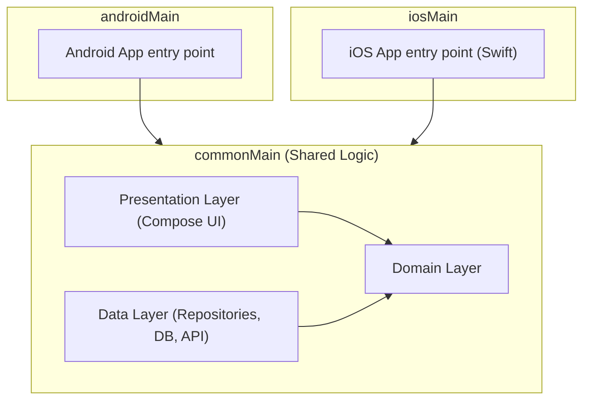

# BankTest - Kotlin Multiplatform Banking App


**BankTest** is a modern, cross-platform mobile banking application built with **Kotlin Multiplatform (KMP)** and **Compose Multiplatform**. It demonstrates best practices in mobile development, focusing on **Clean Architecture**, **Solid Principles**, and a robust **Offline-First** strategy.

## 📚 Documentation
-   [System Architecture & Design Decisions](docs/ARCHITECTURE.md)
-   [CI/CD Pipeline](docs/CI_CD.md)
-   [Contributing Guidelines](CONTRIBUTING.md)
-   [Changelog](CHANGELOG.md)

## 📱 Features

-   **Cross-Platform UI**: 100% shared UI code for Android and iOS using Compose Multiplatform.
-   **Dashboard**: View account summaries with a premium, dynamic UI.
-   **Account Details**: Drill down into accounts to view operations grouped by date.
-   **Offline-First**: Full functionality without internet connection using local caching (Room Database).
-   **Data Security**: Encrypted local database using **SQLCipher**.
-   **Dynamic Settings**: Switch between "Remote" (Live) and "Mock" (Local) data sources on the fly.
-   **Responsive Design**: Adaptive layouts with edge-to-edge support and custom animations.

## 🛠 Tech Stack

This project leverages the latest technologies in the Kotlin ecosystem:

| Category | Technology | Description |
| :--- | :--- | :--- |
| **Language** | [Kotlin 2.3+](https://kotlinlang.org/) | Modern, concise, and safe programming language. |
| **UI Framework** | [Compose Multiplatform](https://www.jetbrains.com/lp/compose-multiplatform/) | Declarative UI framework shared across platforms. |
| **Architecture** | [Clean Architecture + MVI](docs/ARCHITECTURE.md) | Scalable and testable app structure. |
| **DI** | [Koin](https://insert-koin.io/) | Lightweight dependency injection framework. |
| **Concurrency** | [Coroutines & Flow](https://kotlinlang.org/docs/coroutines-overview.html) | Asynchronous programming and reactive streams. |
| **Networking** | [Ktor Client](https://ktor.io/) | Multiplatform asynchronous HTTP client. |
| **Persistence** | [Room KMP](https://developer.android.com/kotlin/multiplatform/room) | SQLite object mapping library with KMP support. |
| **Encryption** | [SQLCipher](https://www.zetetic.net/sqlcipher/) | Full database encryption for SQLite. |
| **Navigation** | [Compose Navigation](https://www.jetbrains.com/help/kotlin-multiplatform-dev/compose-navigation.html) | Type-safe navigation for Compose. |
| **Quality** | Detekt, Ktlint, Kover | Static analysis, formatting, and code coverage. |
| **Testing** | JUnit, Espresso, MockK | Comprehensive unit and UI testing. |

## 🏛 Architecture Summary

For a deep dive into the architecture, layers, and design decisions, please read [ARCHITECTURE.md](docs/ARCHITECTURE.md).

The app follows **Clean Architecture** principles:
1.  **Domain Layer**: Pure business logic (Entities, Use Cases).
2.  **Data Layer**: Repositories, Data Sources (Room, Ktor), Mappers.
3.  **Presentation Layer**: UI (Compose), ViewModels (MVI).

## 📂 Project Structure



```text
├── build-logic/            # Custom Gradle Convention Plugins
├── composeApp/             # Main Multiplatform Module
│   ├── src/
│   │   ├── commonMain/     # Shared Logic & UI (Android + iOS)
│   ├── androidDeviceTest/  # Instrumentation Tests
├── iosApp/                 # iOS Native Entry Point (Swift)
├── docs/                   # Detailed Documentation
├── CONTRIBUTING.md         # Contribution Guidelines
└── LICENSE                 # MIT License
```

## ✅ Quality & Testing

We enforce high standards for code quality and testing:

-   **Unit Tests**: Domain and Data layers are fully tested using JUnit and MockK.
-   **Instrumentation Tests**: UI tests run on Android devices/emulators to verify layout and flows.
-   **Linting**:
    -   **Ktlint**: Enforces Kotlin coding styles.
    -   **Detekt**: Static code analysis for code smells and complexity.
    -   **Compose Rules**: Specific lint checks for Jetpack Compose best practices.
-   **Code Coverage**: **Kover** is integrated to track test coverage (minimum 90% enforced).

### Running Checks

```bash
# Run Unit Tests
./gradlew test

# Run JVM Unit Tests (for Kover coverage)
./gradlew :composeApp:jvmTest

# Run Instrumentation Tests
./gradlew connectedAndroidTest

# Run Linting
./gradlew detekt ktlintCheck

# Generate Coverage Report
./gradlew koverHtmlReport

# Generate Coverage XML (for Sonar)
./gradlew koverXmlReport
```

## 🚀 Getting Started

### Prerequisites
-   **Android Studio**: Ladybug or newer.
-   **JDK**: Version 17.
    -   *Tip*: Use [SDKMAN!](https://sdkman.io/) to manage JDK versions: `sdk install java 17.0.10-tem`
-   **Xcode**: Required for iOS build.
-   **SQLCipher Key**: Provide `SQLCIPHER_PASSPHRASE` in your environment (required for encrypted database).

### Build & Run

**Android:**
Open the project in Android Studio and run the `composeApp` configuration.

**iOS:**
Open `iosApp/iosApp.xcworkspace` in Xcode and run on a simulator.

---
*Created by Hatem Noureddine*
