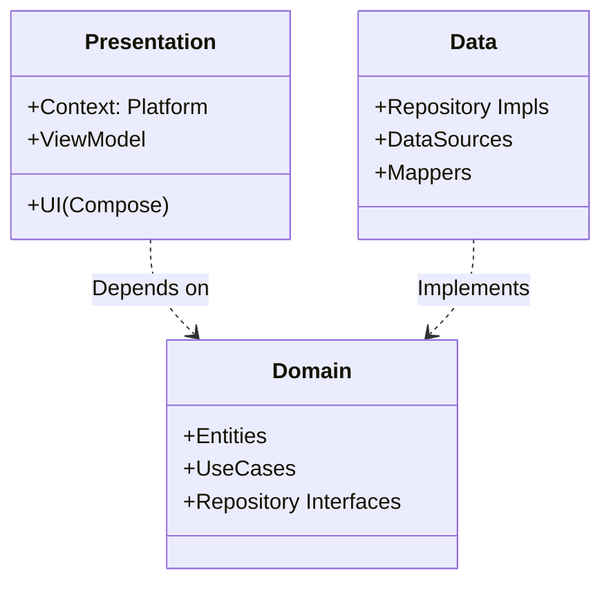
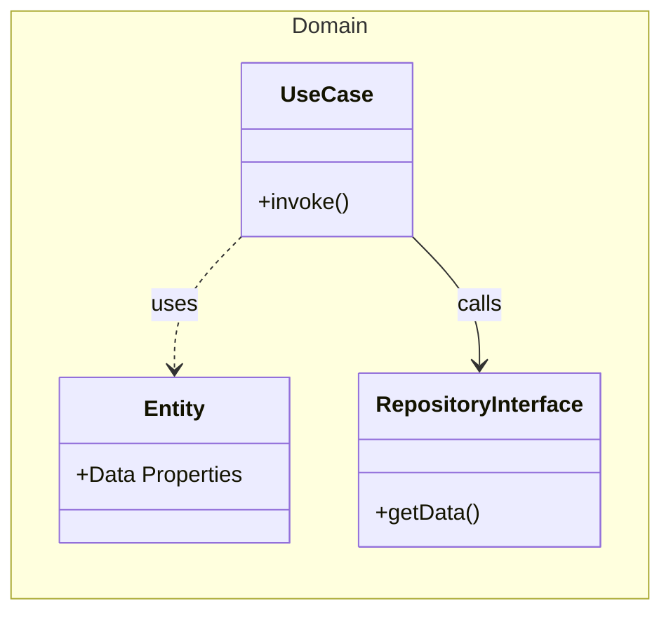
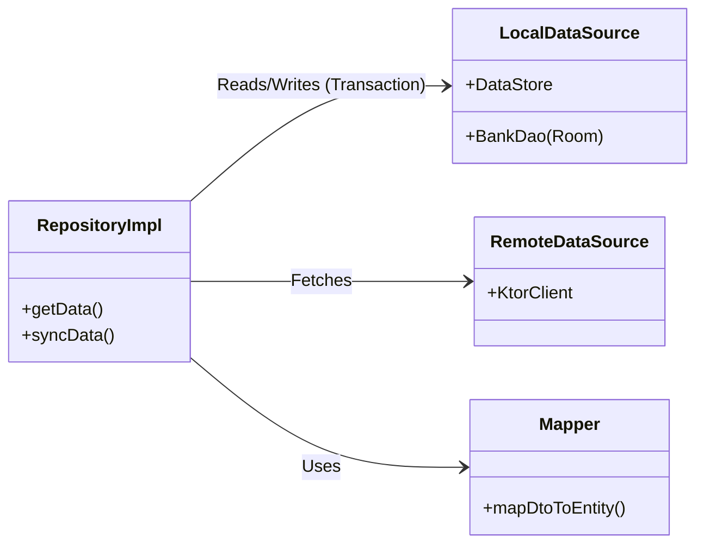
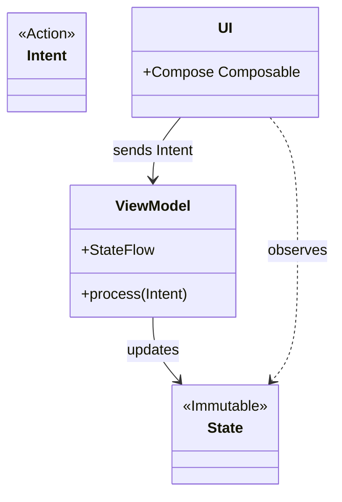
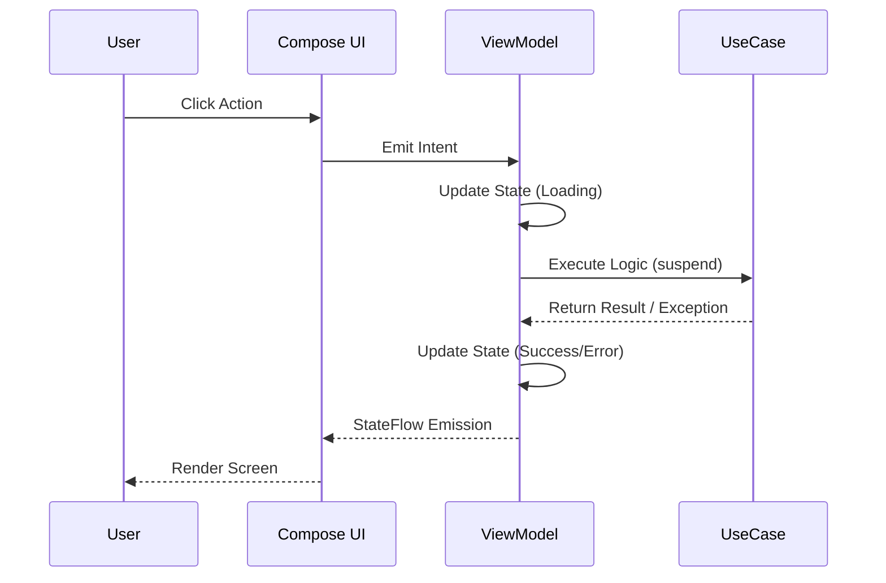
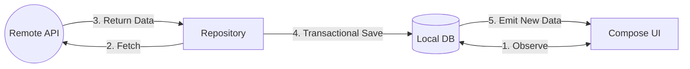
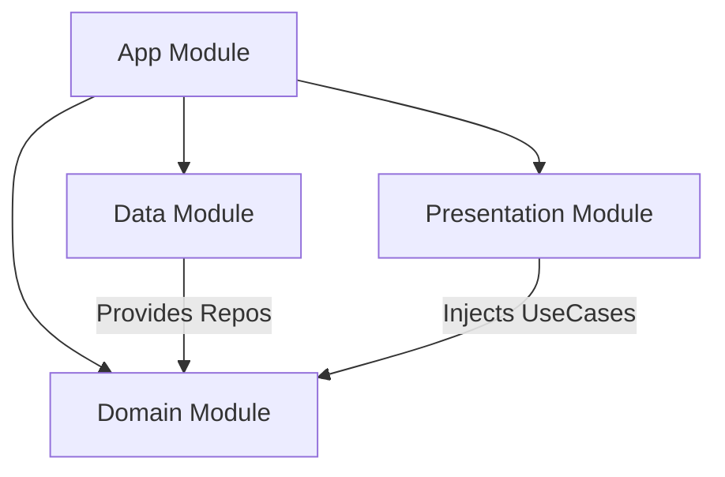

# System Architecture

The **BankTest** application is built on a foundation of **Clean Architecture** and **Model-View-Intent (MVI)** to ensure scalability, testability, and a clear separation of concerns.

## Architectural Layers

The application is strictly divided into three layers, with dependencies pointing inwards (Presentation -> Domain <- Data).

### 1. Domain Layer (The Core)
This layer contains the business logic and rules of the application. It is completely independent of frameworks.

-   **Entities**: Pure Kotlin data classes (e.g., `Account`).
-   **Use Cases**: These are the entry points to the domain. They invoke repositories and organize business logic. We use the **Executable Use Case** pattern where each class has a single public `operator fun invoke`.
-   **Repository Interfaces**: Abstractions defining *what* data operations are available.

### 2. Data Layer (The Infrastructure)
This layer handles data retrieval and storage.

-   **Repositories**: Implement interfaces. They coordinate `Remote` and `Local` sources.
-   **Reactive Data Flow**: Repositories expose `Flow<T>` which emits updates whenever the local database changes.
-   **Data Sources**:
    -   **Remote**: `Ktor` client managing network requests (JSON).
    -   **Local**: `Room` database (SQLite) managing persistent storage.
    -   **Preferences**: `DataStore` for lightweight metadata like "Last Sync Time".
-   **Mappers**: Convert DTOs to Domain Entities.

### 3. Presentation Layer (The UI)
Responsible for rendering UI and handling user input using the MVI Pattern.

### MVI Structure

### MVI Interaction Flow

## Cross-Cutting Concerns

### Error Handling
Errors (Network exceptions, Database errors) are propagated from the Data Layer up to the ViewModel.
-   **Repositories** do not catch exceptions mainly; they let them bubble up.
-   **ViewModels** launch coroutines (usually with `viewModelScope`) and must handle exceptions (using `try/catch` or `CoroutineExceptionHandler`) to update the UI State with an Error message.

### Concurrency
-   **Coroutines**: Used for all asynchronous operations.
-   **Flow**: Used for data streams (observing Database).
-   **Suspending Functions**: Used for one-shot operations (Sync, API calls).
-   **Dispatchers**: IO Dispatcher is used for Data operations (Room and Ktor handle this internally usually, but we ensure off-main-thread execution).

### Offline-First Data Synchronization

### Dependency Injection (Koin)

We use **Koin** for its lightweight nature and KMP support.

At runtime, the active data source module (Remote vs Mock) is loaded based on the current App Mode.

### Security (SQLCipher)
To protect sensitive banking data, we use **SQLCipher** to encrypt the local SQLite database.
