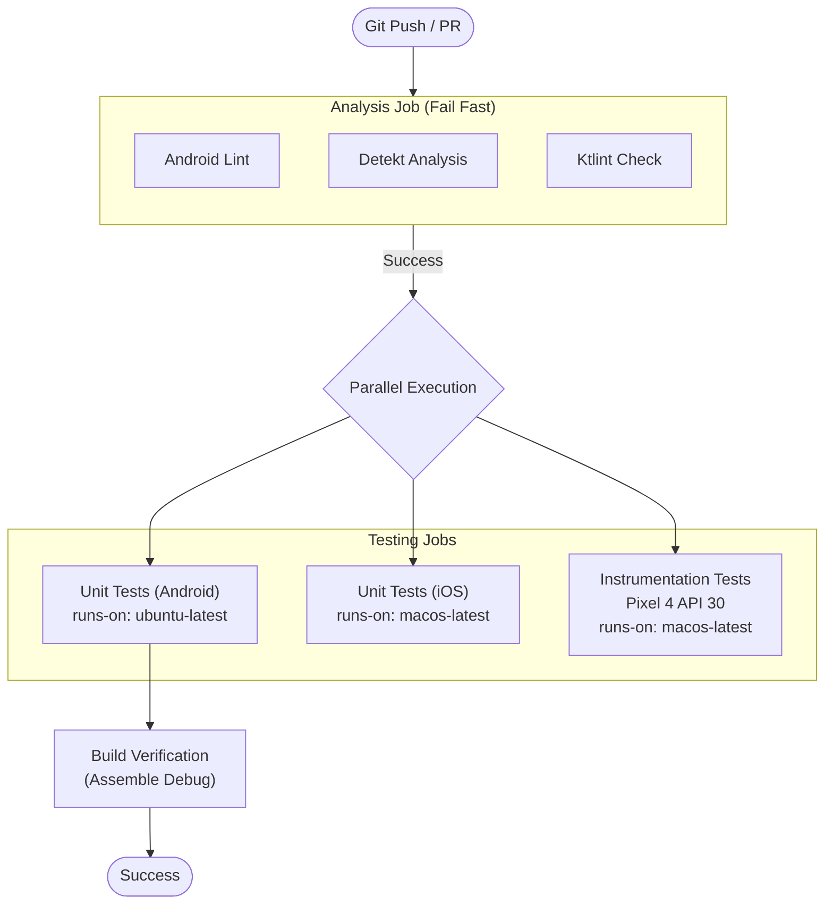

# CI/CD Pipeline

We use **GitHub Actions** to automate our code quality checks, testing, and build verification. This ensures that every Pull Request maintains the stability and quality of the codebase.

## Workflow Overview

The pipeline is defined in `.github/workflows/code_quality.yml`. It triggers on:
-   `push` to `main` and `develop`
-   `pull_request` to `main` and `develop`

### Pipeline Visualization

## Jobs Description

### 1. Analysis (Fail Fast)
This job runs first. If it fails, the pipeline stops immediately to save resources.
-   **Detekt**: Analyzes code complexity, potential bugs, and code smells (SARIF report uploaded for code scanning).
-   **Ktlint**: Enforces standard Kotlin coding conventions (indentation, spacing).
-   **Android Lint**: Checks for Android-specific issues (deprecated APIs, manifest errors, resource issues).
-   **Kover**: Generates XML coverage reports used by Sonar and enforces a minimum coverage threshold.
    -   Coverage is computed from the JVM target (`:composeApp:jvmTest`), which runs shared `commonTest` on JVM.
-   **Artifacts**: Automatically uploads HTML/XML reports if any check fails for easier debugging.

### 2. Unit Tests (Parallel)
Runs pure logic tests for both platforms.
-   **Android**: using JUnit 4/5 and MockK on `ubuntu-latest`.
-   **iOS**: using `iosSimulatorArm64Test` on `macos-latest`. This ensures the shared business logic works correctly on the iOS target architecture.

### 3. Instrumentation Tests
Runs UI and ecosystem-dependent tests on a real Android environment.
-   **Environment**: Runs on `macos-latest` to enable hardware acceleration for Android emulation.
-   **Emulator**: Spawns a dedicated **Pixel 4 (API 30)** emulator using the `reactivecircus/android-emulator-runner` action.
-   **Scope**: Verifies `androidDeviceTest` code, checking UI flows, Navigation, and Koin integration in a real Application context.

### 4. Build Verification
Ensures the application assembles correctly into an APK.
-   **Command**: `./gradlew assembleDebug`.
-   **Purpose**: Verifies that resources binding (R class), Manifest merging, and dexing all succeed.

## Optimization Strategy

### Caching
We use `gradle/actions/setup-gradle@v3` which provides:
-   **Distribution Caching**: Downloads and caches the specific Gradle Wrapper version.
-   **Dependency Caching**: Caches `~/.gradle/caches` (jars, aars) to avoid re-downloading Maven artifacts.
-   **Build Cache**: Caches task outputs (up-to-date checks) between runs.

### Concurrency Management
We use `concurrency: group: ${{ github.ref }}` with `cancel-in-progress: true`.
-   **Why?** If you push 3 commits to a PR in rapid succession, only the latest commit needs to be verified. The previous two runs will be automatically cancelled to save CI minutes and reduce queue times.

### Sonar
Sonar analysis runs only when `SONAR_TOKEN` is available (e.g., on the main repo, not forks).
